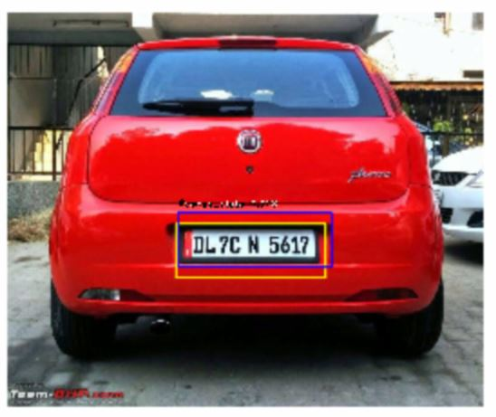

# Object Detection
* 기존 [fizyr/keras-retinanet](https://github.com/fizyr/keras-retinanet) 코드를 수정하여, tensorflow 2.1.0 버전에서 사용할 수 있도록 수정.
* 
## Dataset
* **[Vehicle Number Plate](https://www.kaggle.com/dataturks/vehicle-number-plate-detection)**
* 위에서 받은 json 파일을 원하는 경로에 넣어 넣어 준다.

##  Dependencies
* tensorflow==2.1.0
* efficientnet==1.0.0
* opencv-python
* progressbar2
* pandas
* numpy
* ...

## References
* [Focal Loss for Dense Object Detection](https://arxiv.org/pdf/1708.02002.pdf)
* [EfficientNet: Rethinking Model Scaling for Convolutional Neural Networkss](https://arxiv.org/pdf/1905.11946.pdf)
* https://www.curiousily.com/posts/object-detection-on-custom-dataset-with-tensorflow-2-and-keras-using-python/
